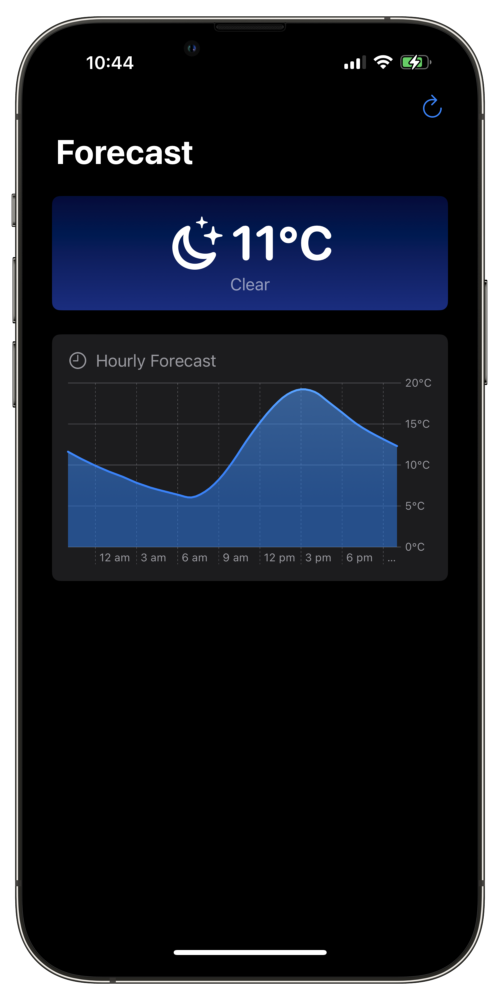

# Forecast

This project is mostly just me messing around with some of the new APIs announced by Apple at WWDC 2022, namely:

- Fetching weather information via WeatherKit
- Using Swift Charts to display the forecast
- Displaying a master / detail UI using the new SwiftUI navigation APIs
- Using Swift's structured concurrency to perform expensive updates on a background thread
- Compiling for macOS, iOS, and iPadOS with a single build target

